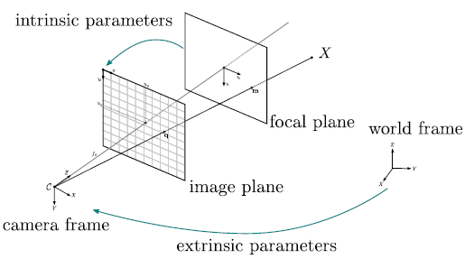
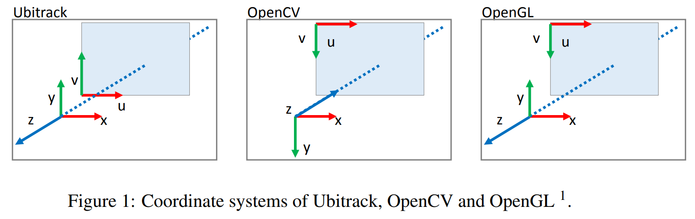

There are various coordinates out there, left/right-handed, image/camera/world coordinate. Combined with rotation/translation, things get worse. Let us clarify these one by one. Note, we try to be constant with OpenCV.

# The coordinates

Image from [OpenMVG doc](http://openmvg.readthedocs.io/en/latest/openMVG/cameras/cameras/#pinhole-camera-model).

.

Image from [Note for coordinate system conversion](http://campar.in.tum.de/twiki/pub/Main/YutaItoh/coordinate_system_summary2.pdf).

# NOTES

* [The x,y and row,col in OpenCV image](xy_col_row.md)
* [The sub-pixel phenomenon](sub_pixel.md)
